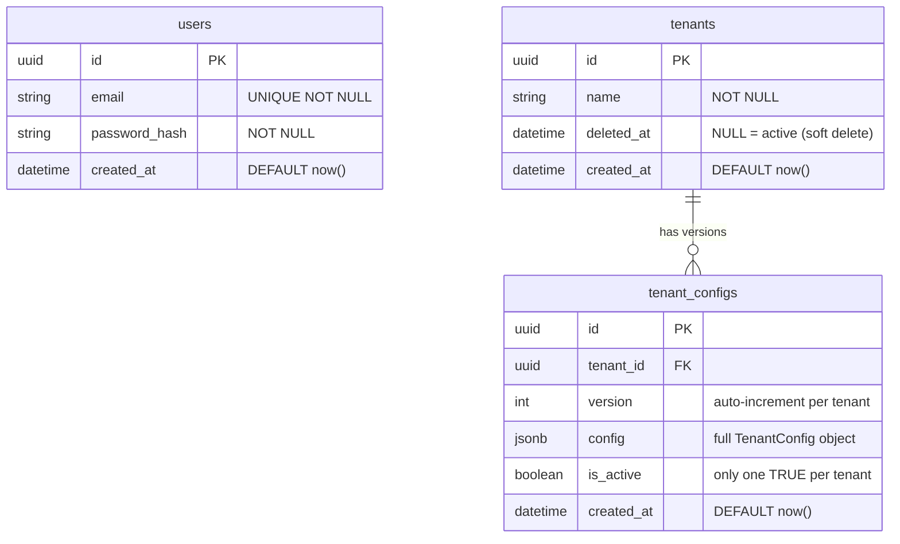

# System Design — Multi-Tenant Insurance Configuration Platform

SA sign-off. All diagrams reflect the implemented system as of M12.

---

## 1. High-Level System Architecture

```
┌─────────────────────────────────────────────────────────────────────┐
│                           Browser (Ops Team)                        │
│                                                                     │
│   ┌─────────────────────────────────────────────────────────────┐   │
│   │                  Admin UI  (Vite + React 19)                │   │
│   │                                                             │   │
│   │  ┌──────────┐  ┌──────────────┐  ┌──────────────────────┐  │   │
│   │  │  Login   │  │  Tenant CRUD │  │  Tools               │  │   │
│   │  │  Page    │  │  + TenantForm│  │  VersionHistory      │  │   │
│   │  └──────────┘  └──────────────┘  │  ClaimTester         │  │   │
│   │                                  │  DiffPage            │  │   │
│   │                                  └──────────────────────┘  │   │
│   │                                                             │   │
│   │  React Router v7 SPA · Redux Toolkit · Ant Design 6        │   │
│   └──────────────────────────────┬──────────────────────────────┘   │
└──────────────────────────────────┼──────────────────────────────────┘
                                   │ HTTPS REST (Bearer JWT)
                                   │
┌──────────────────────────────────▼──────────────────────────────────┐
│                     Express API  (Node.js + TypeScript)             │
│                                                                     │
│  ┌─────────────┐  ┌──────────────────┐  ┌──────────────────────┐   │
│  │  Auth       │  │  Tenants         │  │  Diff                │   │
│  │  /api/auth  │  │  /api/tenants    │  │  /api/diff           │   │
│  └─────────────┘  └──────────────────┘  └──────────────────────┘   │
│                                                                     │
│  ┌──────────────────────────────────────────────────────────────┐   │
│  │                  processClaim Engine (pure)                  │   │
│  │  resolveDocuments → resolveApprovalTiers →                   │   │
│  │  resolveNotifications → calculateSlaDeadline →               │   │
│  │  resolveCustomFields → validateCustomFieldValues             │   │
│  └──────────────────────────────────────────────────────────────┘   │
│                                                                     │
│  Middleware: auth (JWT) · validate (Zod) · error handler            │
└──────────────────────────────────┬──────────────────────────────────┘
                                   │ Prisma ORM
                                   │
┌──────────────────────────────────▼──────────────────────────────────┐
│                         PostgreSQL                                  │
│                                                                     │
│    users          tenants          tenant_configs                   │
│    ─────          ───────          ──────────────                   │
│    id (uuid)      id (uuid)        id (uuid)                        │
│    email          name             tenant_id → tenants.id           │
│    password_hash  deleted_at?      version (int)                    │
│    created_at     created_at       config (jsonb)                   │
│                                    is_active (bool)                 │
│                                    created_at                       │
└─────────────────────────────────────────────────────────────────────┘
```

**Deployment:**
- Frontend → Vercel (static CDN)
- Backend + PostgreSQL → Railway

---

## 2. Database ER Diagram



**Key constraints:**
- `(tenant_id, version)` — unique index; version is sequential per tenant, not global
- `is_active = true` — exactly one per tenant, enforced at app layer on every write
- `deleted_at IS NULL` — all read queries filter deleted tenants; soft delete only
- No `claims` table — `processClaim` is stateless computation, nothing is persisted

---

## 3. Config JSONB Schema (abridged)

```
tenant_configs.config: {
  branding: {
    companyName, logoUrl?, primaryColor (#hex), secondaryColor (#hex)
  }
  claimTypes: {                        // partial record — only configured types
    [OUTPATIENT | INPATIENT | DENTAL | MATERNITY | OPTICAL]: {
      enabled: boolean
      requiredDocuments: string[]
      optionalDocuments: string[]
    }
  }
  approvalRules: {
    autoApprovalThreshold: number      // ≥ 0; 0 = all manual
    approvalTiers: [{ tier, minAmount, maxAmount?, role, level, isPrimary? }]
  }
  notifications: [{
    event: claim_submitted|approved|rejected|payment_sent
    channels: (email|sms|webhook)[]
    template?: string                  // {{variable}} interpolation
  }]
  sla: {
    timezone: string                   // IANA e.g. "Asia/Bangkok"
    workDays: (0..6)[]
    holidays: string[]                 // ISO dates
    perClaimType: { [ClaimType]: number }   // business days; only enabled types
    escalationContacts: string[]
  }
  customFields: [{
    name, label, type, required, options?, min?, max?
  }]
}
```

---

## 4. API Surface

### Auth
| Method | Path | Description |
|--------|------|-------------|
| POST | `/api/auth/login` | Email + password → JWT (24h) |
| POST | `/api/auth/logout` | Stateless; client discards token |

### Tenants
| Method | Path | Description |
|--------|------|-------------|
| GET | `/api/tenants?page&pageSize&showDeleted` | Paginated list; `showDeleted=true` includes soft-deleted |
| GET | `/api/tenants/:id` | Tenant + active config |
| POST | `/api/tenants` | Create tenant + first config version |
| PUT | `/api/tenants/:id` | Save new config version, set active |
| DELETE | `/api/tenants/:id` | Soft-delete (set deleted_at) |
| GET | `/api/tenants/:id/versions` | All versions (paginated) |
| GET | `/api/tenants/:id/versions/:versionId` | Single version config |
| POST | `/api/tenants/:id/rollback/:versionId` | New version = copy of target, set active |
| POST | `/api/tenants/:id/process-claim` | Run processClaim engine |

### Tools
| Method | Path | Description |
|--------|------|-------------|
| GET | `/api/diff?a=:id&b=:id` | Deep-diff two active configs |

### Standard response envelope
```json
{ "code": 200, "message": "ok", "data": <payload> }
{ "code": 400, "message": "Validation error", "details": [...] }
{ "code": 401, "message": "Unauthorized" }
{ "code": 404, "message": "Not found" }
```

---

## 5. processClaim Data Flow

```
POST /api/tenants/:id/process-claim
  { claimType, amount, submittedAt, customFieldValues }
          │
          ▼
  1. Fetch active TenantConfig from DB (config JSONB)
          │
          ▼
  2. resolveDocuments(config, claimType)
     → requiredDocuments: string[]
          │
          ▼
  3. resolveApprovalTiers(config, amount)
     → autoApproved: bool, approvalTier: { role, level }
       ┌─ amount ≤ autoApprovalThreshold → autoApproved = true
       └─ else → first tier where amount ∈ [min, max] or isPrimary fallback
          │
          ▼
  4. resolveNotifications(config, 'claim_submitted')
     → notifications: [{ event, channels, template? }]
       template variables: {{claimType}}, {{amount}}, {{tenantName}}, {{slaDeadline}}
          │
          ▼
  5. calculateSlaDeadline(config, claimType, submittedAt)
     → slaDeadline: Date
       uses dayjs + timezone + workDays + holidays + perClaimType days
          │
          ▼
  6. resolveCustomFields(config)
     → customFieldsRequired: [{ name, label, type, required, ... }]
          │
          ▼
  7. validateCustomFieldValues(customFieldValues, definitions)
     → errors: [{ field, message }]
          │
          ▼
  Response: { requiredDocuments, autoApproved, approvalTier,
              notifications, slaDeadline, customFieldsRequired }
```

**Invariant:** no switch/case on tenantId anywhere in steps 1–7. All branching is driven by the config JSONB.

---

## 6. Frontend Component Tree

```
<App>  (Vite entry, Redux Provider, AntdProvider, React Router)
 ├── /login          → <LoginPage>
 └── /               → <AdminShell>  (Layout + Sider + Header)
      ├── /tenants       → <TenantsPage>
      │    └── Table · Popconfirm delete · showDeleted Switch
      ├── /tenants/new   → <TenantDetailPage> (create mode)
      │    └── <TenantForm>
      │         ├── Branding section
      │         ├── Claim Types section  (Switch + doc lists)
      │         ├── Approval Rules section  (threshold + tier builder)
      │         ├── Notifications section  (event × channel matrix)
      │         ├── SLA section  (timezone + workdays + perClaimType)
      │         └── Custom Fields section  (dynamic field builder)
      ├── /tenants/:id   → <TenantDetailPage> (edit mode)
      │    ├── Tab: Configuration  → <TenantForm>
      │    ├── Tab: Version History → <VersionHistory>
      │    │    └── Drawer: <ConfigPreview>
      │    └── Tab: Claim Tester   → <ClaimTester>
      └── /diff          → <DiffPage>
           ├── <TenantSummaryCard> × 2
           └── Ant Design Table (diff rows)
```

---

## 7. State Management (Redux Toolkit)

| Slice | State | Source of truth |
|-------|-------|-----------------|
| `auth` | `token: string \| null` | localStorage + Redux |
| `tenants` | `list: TenantRow[]`, `page`, `total` | API → Redux |

All other page state is local React (`useState` / `useReducer`). No global state for form values or claim tester results.

---

## 8. Security

| Concern | Approach |
|---------|----------|
| Authentication | JWT (24h expiry), `Authorization: Bearer <token>` |
| 401 handling | FE API client auto-redirects to `/login`, clears token |
| Password storage | bcrypt hash |
| Input validation | Zod on both FE (form) and BE (request body via middleware) |
| Soft delete | `deleted_at IS NULL` filter on all tenant reads; no data destroyed |
| Tenant isolation | All tenant API routes include `requireTenant` guard (404 + not-deleted check) |

---

## 9. Key Design Decisions

| Decision | Choice | Rationale |
|----------|--------|-----------|
| Config storage | Single JSONB column per version | Schema flexibility; adding a config dimension = no migration |
| Config versions | Append-only, never mutate | Full audit trail; rollback = new version (no destructive writes) |
| processClaim | Pure function, no DB writes | Testable in isolation; stateless = horizontally scalable |
| Soft delete | `deleted_at` nullable column | Preserves config history; restoring is possible |
| 4th tenant | Zero code changes required | All logic driven by config JSONB; no hardcoded tenant branches |
| claimTypes | Partial record | Tenants configure only the types they need |
| Diff response | Enriched `{ id, name, config }` per side + `section` per entry | FE can render summary cards and category filters without extra fetches |
| Theme | Static teal palette (`buildTheme()`) | No per-tenant branding in admin shell; avoids re-render on every edit |
